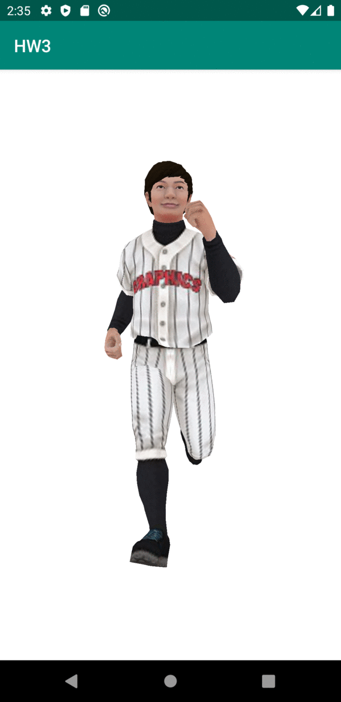

# Homework 3
The homework 3 tests your understand about character animation and shadow. 

* [Procedure](#procedure)
* [Result](#result)
* [Deadline](#deadline)
* [Note](#note)

## Procedure
1. Download the files in this repository and unzip the OpenGLES_HW3.zip. 
   - (Password is required. Please check the klas information.)
2. Follow the instructions provided by GG_HW3_guide.pdf
3. Invest your time to achieve the goal!

## Result
Problem result:  

## Deadline
* If spring class: 6.26. 23:50

## Note
* TA: jeunlee0306@khu.ac.kr (이정은)
* Please send your questions to TA first. 
* OpenGLES uses column major order. 
* Thank you for your star.
